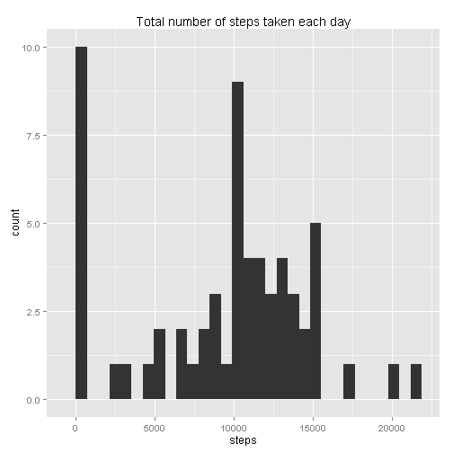
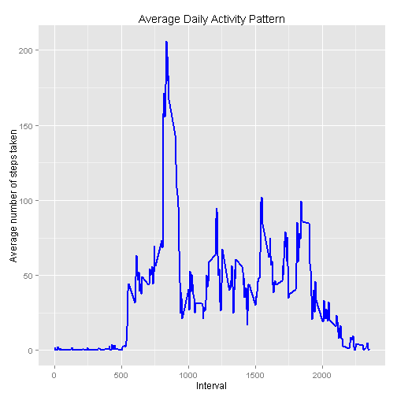
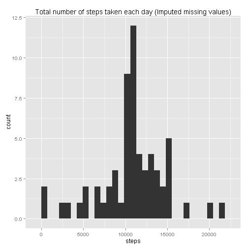
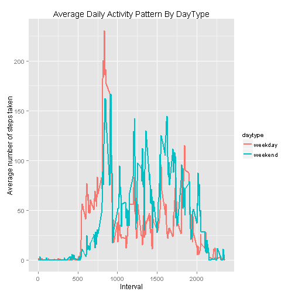

#### Title: 'Reproducible Research: Course Project 1'


```r
library(ggplot2)
```

## Loading and preprocessing the data

##### 1. Load the data

```r
if(!file.exists('activity.csv')){
    unzip('repdata_data_activity.zip')
}
activityData <- read.csv('activity.csv')
```

##### 2. Process/transform the data

```r
#Not neccessary to process the data, keep with original dataset for next analysis
#activityData$interval <- gsub("([0-9]{1,2})([0-9]{2})", "\\1:\\2", sprintf('%04d',activityData$interval))
```

## Total number of steps taken each day

##### 1. Show the total number of steps taken each day

```r
total_steps_perday <- aggregate(activityData$steps, list(activityData$date), sum, na.rm=TRUE)
colnames(total_steps_perday) <- c("date","steps")
total_steps_perday
```

```
##          date steps
## 1  2012-10-01     0
## 2  2012-10-02   126
## 3  2012-10-03 11352
## 4  2012-10-04 12116
## 5  2012-10-05 13294
## 6  2012-10-06 15420
## 7  2012-10-07 11015
## 8  2012-10-08     0
## 9  2012-10-09 12811
## 10 2012-10-10  9900
## 11 2012-10-11 10304
## 12 2012-10-12 17382
## 13 2012-10-13 12426
## 14 2012-10-14 15098
## 15 2012-10-15 10139
## 16 2012-10-16 15084
## 17 2012-10-17 13452
## 18 2012-10-18 10056
## 19 2012-10-19 11829
## 20 2012-10-20 10395
## 21 2012-10-21  8821
## 22 2012-10-22 13460
## 23 2012-10-23  8918
## 24 2012-10-24  8355
## 25 2012-10-25  2492
## 26 2012-10-26  6778
## 27 2012-10-27 10119
## 28 2012-10-28 11458
## 29 2012-10-29  5018
## 30 2012-10-30  9819
## 31 2012-10-31 15414
## 32 2012-11-01     0
## 33 2012-11-02 10600
## 34 2012-11-03 10571
## 35 2012-11-04     0
## 36 2012-11-05 10439
## 37 2012-11-06  8334
## 38 2012-11-07 12883
## 39 2012-11-08  3219
## 40 2012-11-09     0
## 41 2012-11-10     0
## 42 2012-11-11 12608
## 43 2012-11-12 10765
## 44 2012-11-13  7336
## 45 2012-11-14     0
## 46 2012-11-15    41
## 47 2012-11-16  5441
## 48 2012-11-17 14339
## 49 2012-11-18 15110
## 50 2012-11-19  8841
## 51 2012-11-20  4472
## 52 2012-11-21 12787
## 53 2012-11-22 20427
## 54 2012-11-23 21194
## 55 2012-11-24 14478
## 56 2012-11-25 11834
## 57 2012-11-26 11162
## 58 2012-11-27 13646
## 59 2012-11-28 10183
## 60 2012-11-29  7047
## 61 2012-11-30     0
```

##### 2. Make a histogram of the total number of steps taken each day

```r
ggplot(total_steps_perday,aes(x=steps)) + geom_histogram(bins=30) +
  labs(title="Total number of steps taken each day")
```

```
## stat_bin: binwidth defaulted to range/30. Use 'binwidth = x' to adjust this.
```

 

##### 3. Calculate and report the mean of the total number of steps taken each day

```r
mean_steps_perday <- mean(total_steps_perday$steps)
mean_steps_perday
```

```
## [1] 9354.23
```
and, median of the total number of steps taken each day

```r
median_steps_perday <- median(total_steps_perday$steps)
median_steps_perday
```

```
## [1] 10395
```


## Average daily activity pattern

##### 1. Make a time series plot of the average number of steps taken

```r
average_steps_interval <- aggregate(steps ~ interval, activityData, mean)

ggplot(average_steps_interval, aes(x=interval,y=steps)) +
 geom_line(color="blue",size=1) +
 labs(title="Average Daily Activity Pattern", x="Interval", y="Average number of steps taken")
```

 

##### 2. Examine which 5-minute interval contains the maximum number of steps

```r
#retrieve the interval column
max_steps_interval <- average_steps_interval[which.max(average_steps_interval$steps),1] 

#convert to interval format
timeMaxSteps <-  gsub("([0-9]{1,2})([0-9]{2})", "\\1:\\2", max_steps_interval) 
```
* Maximum number of steps at: **8:35** interval

## Imputing missing values

##### 1. Calculate and report the total number of missing values in the dataset

```r
total_missing <- sum(is.na(activityData$steps))
```
* Total number of missing values: **2304**

##### 2. Devise a strategy for filling in all of the missing values in the dataset

```r
#use strategy - mean for 5-minute interval
avg_interval <- tapply(activityData$steps,activityData$interval, mean, na.rm=TRUE, simplify=TRUE)

#identify number of NAS in the dataset
nas <- is.na(activityData$steps)
```

##### 3. Create a new dataset (using the original dataset) but with the missing data filled in

```r
#define new dataset
activityData_imputed <- activityData

#filled new dataset missing values (NAS) with average values for 5-minute interval
activityData_imputed$steps[nas] <- avg_interval[as.character(activityData_imputed$interval[nas])]
```
  
##### 4. After missing values are imputed,
- Make a histogram of total number of steps taken each day.

```r
total_steps_perday_imputed <- aggregate(steps ~ date, activityData_imputed, sum)

ggplot(total_steps_perday_imputed, aes(x=steps)) + geom_histogram(bins=30) +
  labs(title="Total number of steps taken each day (Imputed missing values)")
```

```
## stat_bin: binwidth defaulted to range/30. Use 'binwidth = x' to adjust this.
```

 

- Calculate the mean of total number of steps taken each day. 

```r
mean_steps_perday_imputed <- mean(total_steps_perday_imputed$steps)
mean_steps_perday_imputed
```

```
## [1] 10766.19
```

- Calculate the median of total number of steps taken each day.

```r
median_steps_perday_imputed <- median(total_steps_perday_imputed$steps)
median_steps_perday_imputed
```

```
## [1] 10766.19
```

## Analyze differences in activity patterns between weekdays and weekends
##### 1. Create a new factor variable with two levels "weekday" and "weekend"

```r
activityData_imputed$daytype <- factor(weekdays(as.Date(activityData_imputed$date))) 

#rename weekdays to factor naming 'weekday' or 'weekend'
levels(activityData_imputed$daytype) <- list (
weekday=c("Monday","Tuesday","Wednesday","Thursday","Friday"),
weekend=c("Saturday","Sunday") 
) 
```

##### 2. Panel plot comparing the average number of steps taken per 5-minute interval across weekdays and weekends

```r
average_steps_daytype <- aggregate(steps ~ daytype + interval, activityData_imputed, mean)

ggplot(average_steps_daytype, aes(x=interval,y=steps, color=daytype)) +
 geom_line(size=1) +
 labs(title="Average Daily Activity Pattern By DayType", x="Interval", y="Average number of steps taken")
```

 
